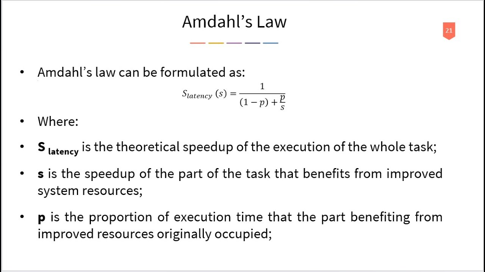

# Multicore Programming and Parallel Computing

## Abstract
This project explores multicore programming techniques to parallelize computationally intensive tasks. Building upon the optimizations from the **02-simd** project, I investigate how to leverage multiple CPU cores to achieve further performance improvements through parallel execution.

---

## 1. Introduction

Multicore processors are widespread in modern computing systems, from mobile devices to high-performance servers. This project utilizes parallel programming paradigms to distribute computational workloads across multiple cores, building upon the SIMD optimizations from the previous project.

**Objective**: To measure and analyze the performance gains from multicore parallelization compared to sequential and SIMD-optimized implementations, and to understand how thread-level parallelism complements data-level parallelism.

---

## 2. Background

Relevant parallel computing concepts:

- **Thread-level Parallelism (TLP)**: Multiple threads execute simultaneously and concurrently contribute to the same computational task, distributing work across available CPU cores.

- **OpenMP**: An industry-standard API that provides compiler directives, runtime library routines, and environment variables for shared-memory parallel programming in C, C++, and Fortran.

- **Race Conditions**: A concurrency issue where shared data is accessed by multiple threads simultaneously without proper synchronization, leading to non-atomic operations and undefined behavior.

- **Thread Synchronization**: Mechanisms and techniques used to eliminate race conditions and ensure thread-safe access to shared resources, preventing data corruption and ensuring program correctness.

- **Load Balancing**: The practice of distributing computational work evenly across processing units to maximize efficiency, minimize response time, and prevent individual cores from becoming bottlenecks.

- **Amdahl's Law**:  A fundamental principle that calculates the theoretical speedup of a program when only a portion of it is parallelized, highlighting the diminishing returns as more processors are added.

---

## 3. Methodology

### 3.1 Implementation Details

I implemented multiple versions of matrix multiplication to compare performance across different optimization strategies:

1. **Naive Implementation**: Basic triple-nested loop approach serving as the baseline
2. **Blocked Implementation**: Cache-optimized version using loop tiling to improve data locality
3. **AVX512 Standard**: SIMD vectorization using AVX512 intrinsics for parallel computation within a single core
4. **AVX512 Blocked**: Combined cache blocking with AVX512 vectorization
5. **OpenMP Parallel**: Thread-level parallelism using OpenMP directives to distribute work across multiple cores
6. **OpenMP Parallel AVX**: Combined OpenMP threading with AVX512 intrinsics for maximum performance
7. **OpenMP Parallel AVX [Optimized]**: Further refinements to memory access patterns and thread scheduling

All implementations perform matrix multiplication of square matrices with verification to ensure correctness.

### 3.2 Experimental Setup

- **Hardware**: CPU with AVX512 support and multiple cores
- **Compiler**: GCC with `-O3 -mavx512f -fopenmp` flags for optimization and OpenMP support
- **Operating System**: Linux 5.15.0-163-generic
- **Test Sizes**:
  - Small: 512×512 matrices
  - Medium: 1024×1024 matrices
  - Large: 2048×2048 matrices

### 3.3 Measurement Method

- **Timing**: High-resolution timing using `clock_gettime()` with `CLOCK_MONOTONIC` to measure execution time
- **Correctness Verification**: Each optimized implementation is validated against the naive implementation to ensure numerical accuracy
- **Averaging**: Multiple runs performed for each configuration to ensure consistent and reliable measurements

---

## 4. Results

### 4.1 Timing Comparison
| Small-size Implementation | Size | Time (seconds) | Speedup |
|----------------|-------|-----------|----------|
| Naive | 512 | 0.0502406 | 1.0× |
| Blocked | 512 | 0.0276674 | 1.81× |
| AVX512 Standard | 512 | 0.0275946 | 1.82× |
| AVX512 Blocked | 512 | 0.0234944 | 2.14× |
| OpenMP Parallel | 512 | 0.0174016 | 2.89x |
| OpenMP Parallel AVX | 512 | 0.0038226 | 13.14x |
| OpenMP Parallel AVX [Optimized] | 512 | 0.0040513 | 12.40x |

| Med - size Implementation | Size | Time (seconds) | Speedup |
|----------------|-------|-----------|----------|
| Naive | 1024 | 0.535251 | 1.0× |
| Blocked | 1024 | 0.28431 | 1.88× |
| AVX512 Standard | 1024 | 0.244953 | 2.19× |
| AVX512 Blocked | 1024 | 0.184856 | 2.90× |
| OpenMP Parallel | 1024 | 0.2506426 | 2.14x |
| OpenMP Parallel AVX | 1024 | 0.0185923 | 28.78x |
| OpenMP Parallel AVX [Optimized] | 1024 | 0.0152996 | 34.98x |

| Large-size Implementation | Size | Time (seconds) | Speedup |
|----------------|-------|-----------|----------|
| Naive | 2048 | 7.0163024 | 1.0× |
| Blocked | 2048 | 3.4543676 | 2.03× |
| AVX512 Standard | 2048 | 2.7734796 | 2.53× |
| AVX512 Blocked | 2048 | 1.8161702 | 3.86× |
| OpenMP Parallel | 2048 | 3.350301 | 2.09x |
| OpenMP Parallel AVX | 2048 | 0.135186 | 51.9x |
| OpenMP Parallel AVX [Optimized] | 2048 | 0.077070 | 91.03x |

### 4.2 Observations

Several key patterns emerge from the performance data:

1. **Scaling with Problem Size**: The benefits of parallelization and vectorization become more pronounced as matrix size increases. The OpenMP Parallel AVX implementation achieves a 13.14× speedup for 512×512 matrices, growing to 91.03× for 2048×2048 matrices.

2. **Synergistic Effects**: Combining OpenMP threading with AVX512 vectorization provides multiplicative benefits rather than just additive improvements. The hybrid approach significantly outperforms either technique in isolation.

3. **Cache Effects**: The blocked implementations show consistent improvements across all sizes, demonstrating the importance of cache-aware algorithms even when using advanced parallelization techniques.

4. **Optimization Trade-offs**: Interestingly, the "Optimized" variant shows slight performance differences compared to the standard OpenMP Parallel AVX implementation, with variations depending on matrix size. This suggests that optimization strategies may need to be tuned based on problem characteristics.

5. **Parallel Efficiency**: The OpenMP-only implementation (without AVX) shows modest speedups (2-3×), indicating that thread-level parallelism alone is limited by memory bandwidth and synchronization overhead. The dramatic improvements come from combining it with vectorization.

---

## 5. Discussion & Conclusion

This project demonstrates that achieving peak performance on modern multicore systems requires a holistic approach that combines multiple optimization techniques:

**Key Findings**:
- OpenMP and AVX512 intrinsics are powerful tools for accelerating computationally intensive operations like matrix multiplication
- The combination of thread-level parallelism (OpenMP) and data-level parallelism (AVX512) unlocks significant performance gains, achieving up to 91× speedup over the naive implementation
- Cache optimization through blocking remains important even when using advanced parallelization, providing a solid foundation for further optimizations
- The effectiveness of optimizations scales with problem size, making these techniques essential for large-scale scientific computing

**Practical Implications**:
These results illustrate why modern high-performance linear algebra libraries (BLAS, LAPACK, etc.) leverage both multicore parallelism and SIMD vectorization. The performance improvements observed here are representative of what can be achieved in real-world numerical computing applications.

**Lessons Learned**:
- Understanding the memory hierarchy is crucial for performance optimization
- Parallelization strategies must consider both computational intensity and memory bandwidth limitations
- Combining complementary optimization techniques (blocking, vectorization, threading) yields the best results
- Performance characteristics can vary with problem size, requiring adaptive optimization strategies

---

## 6. Future Work

- GPU acceleration with CUDA
- Hybrid MPI + OpenMP approaches
- Advanced synchronization techniques
- NUMA-aware optimizations

---
