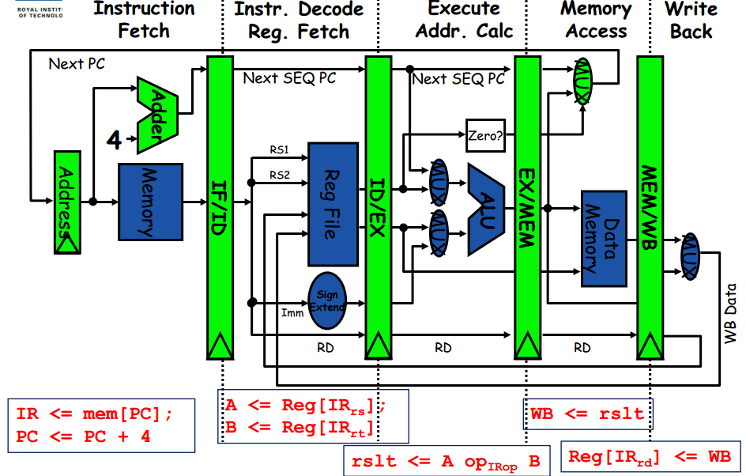
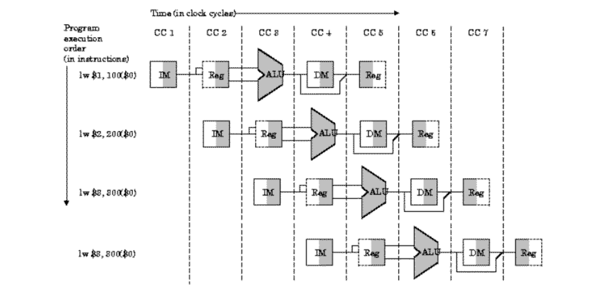

# SIMD Vectorization, Matrix Algorithms, AVX-512 Intrinsics, and CPU Data Pipelines

## Abstract
This project seeks to improve upon standard C matrix multiplication algorithms shown in the **C_Matrix** project by using the AVX-512 instruction set. I used these instructions to SIMD vectorize my matrix operations in various ways to efficiently use cache locality and fully utilize the comparative speed of registers. As a result, I did infact create algorithms that are faster than previous tries.

---

## 1. Introduction

- Matrix multiplication has an extremely wide variety of applications, notably in: data transformations in computer graphics, machine learning, physics, and engineering. Neural networks are computationally mostly matrix multiplication, with some nonlinear function application and derivatives.
- I seek to use the register based AVX-512 instruction set to speed up otherwise cache-heavy matrix algorithms that I have written in the **C_Matrix** project.
- I also inspect in detail blocking since it had the best performance of my original functions from **C_Matrix**.
- Objective: To measure how blocking and AVX-512 affect performance compared to a naive implementation.

---

## 2. Background

- Relevant computer architecture concepts:
  - __Spatial locality__: The principle that locations near a recently accessed memory block have a high probability of being accessed soon as well. CPU's take advantage of this principle by prioritizing memory in close proximity to memory already accessed to speed up access time.
  - __Temporal locality__: The principle that memory that has been accessed recently has a high probability of being accessed again soon. CPU's take advantage of this principle by prioritizing memory accessed recently to speed up access time.
  - __Cache Hierarchy__: Modern computers contain a hierarchy of L1d, L1i, L2, and L3 caches. The L1d cache (L1 data cache) stores recently used data so the CPU can access it almost instantly in the least clock cycles possible. The L1i cache (L1 instruction cache) has a similar role but for accessing CPU instructions to execute tasks very quickly. The L2 cache is larger than the L1 cache but has slower access time. The L3 cache is even larger but has even slower access time. 
  - __Cache architecture__:
    - __Cache block__: The basic unit for cache storage. Can contain multiple bytes/words of data.
    - __Cache line__: This is the exact same thing as cache block. This is not a "row" in the cache.
    - __Cache set__: A "row" in the cache. The number of blocks per set is determined by the cache layout.
  - __Cache indexing__: We have three parts for a cache memory address:
    - __Tag bit__: The bits of the address that uniquely identify the memory block within its set.
    - __Index__: The bits that determine which set in the cache the block maps to.
    - __Offset__: The bits that specify the exact location of the requested data within the block.
  - __Cache layouts__:
    - __Direct mapped__: Each block of main memory can be mapped to only one specific cache line (block).
    - __Set associative__: Each block of main memory can be mapped to any of the lines within a specific set.
    - __Fully associative__: Each block of main memory can be mapped to any cache line.
  - __Cache thrashing__: Occurs most commonly with data having the size in a power of 2. This is when data being stored and accessed of a size that fits cache lines very well is repeatedly used. This can result in the same cache lines that fit this data well to repeatedly be used causing a performance bottleneck because the whole capactiy of the cache is not being used. Sometimes data with less ideal size (2^n -1 size, for example) does not perfectly fit among any cache lines so it is evenly distributed to all cache lines. This is not so much as a flaw but really is a necessary limitation of modern computers.
  - __Single Instruction, Multiple Data (SIMD) execution__: As said in the name, incorporates multiple data being manipulated in one instruction, most commonly utilized by registers.
  - __AVX-512 Intrinsics__: An instruction set created by Intel that uses specific functions and types to specifically create machine code that puts your data into registers of a certain size (for AVX-512 in particular, size = 512 bits = 8 doubles). This enables us to do register-level operations which happen in single instructions to employ SIMD.
  - __CPU Data Pipeline__: A hardware pipeline that ultimately handles instructions from the machine. There are multiple stages of this pipeline in hardware:
    - __IF (Instruction Fetch)__: Fetch the instruction from the instruction cache using the Program Counter (PC). The PC is then incremented (or changed if there’s a branch).
    - __ID (Instruction Decode/Register Fetch)__: Decode the instruction to figure out what kind it is (e.g., ADD, LOAD). Read operands from registers.
    - __EX (Execute/Address Calculation)__: Perform the ALU operation (e.g., addition, subtraction) or compute the memory address for load/store.
    - __MEM (Memory Access)__: Access data memory if needed (for loads and stores). Otherwise, skip this. Our SIMD instructions just accessing registers will skip this a lot.
    - __WB (Write Back)__: Write the result of the computation (or loaded data) back into a register.

  

  - __Pipeline Method__: Since these hardware functions are separate and (usually) not dependent on eachother, they can all be run at the same time like an assembly line in a factory. The graph below shows the multi-stage protocol when executing multiple instructions in a pipeline and how that setup changes over time in clock cycles (CC #).

  <!--  -->

  - __Pipeline Hazards__: There are a number of problems that arise when instructions overlap:

    - __Structural Hazard__: Hardware resource conflict (shared data between two or more instructions in the pipeline).
    - __Data Hazard__: Instruction depends on a previous result not yet written. Solved via forwarding or stalling.
    - __Control Hazard__: Branch prediction is wrong, then we get a pipeline flush.


  - __ALU Operations__: The output of the MUX (multiplexer) is taken as an input to the ALU. The ALU uses its internal logic circuits, such as adders and logic gates, to carry out the specified function on the input operands. Result is stored in a temporary holding register called a latch.

---

## 3. Methodology

### 3.1 Implementation Details
- Describe the algorithms implemented (naive, blocked, SIMD, etc.). First I implemented AVX-512 intrinsics by simply vectorizing my standard matrix function by going through the last loop in increments of 8 (because 512 bits = 8 doubles) and loading 8 doubles into a **__m512** type vector from the rows, and the same for another **__m512** type vector.
- The load instruction I used was:
```c
__m512d _mm512_loadu_pd (void const* mem_addr)
```
- Since reading data into a register for a **__m512** vector reads 512 bits contigously onward from the pointer it was passed, the standard matrix multiplication *i-j-k* function would not work because matrix B has its data read by column, so I had to transpose the matrix to read matrix B's data contiguously.
- I created an accumulator vector called *acc* that was set to the 0 vector everytime the innermost loop was about to run with the instruction:
```c
__m512d _mm512_setzero_pd ()
```
- This accumulator vector was used to accumulate the vectors that resulted from each iteration of the innermost loop and be added to as a single entry by summing the elements with this instruction:
```c
double _mm512_reduce_add_pd (__m512d a)
```
- In the loop, for each iteration the accumulator was updated with this instruction:
```c
__m512d _mm512_fmadd_pd (__m512d a, __m512d b, __m512d c)
```
- This instruction above takes in vectors *a* and *b* and pairwize multiplies them, and adds them to vector *c*. I simply put *acc* as the argument for vector *c* and assigned what this operation returns to be *acc*.
- That concludes our basic intrinsic operations, which tell the computer with machine code to put our vectors into registers and perform the standard matrix operations I have shown above.
- I used the keyword *static* for this function to limit the scope to internal use to try to help the compiler know that this function has a specific use.
- I also used the GNU compiler extension:  *\_\_attribute__((always_inline))*. This directive instructs the compiler to inline the function regardless of any other factors.
- Below is the standard avx matrix multiplication function with its comments removed:

```c
static __attribute__((always_inline)) inline void 
avx_matrix_multiply(struct Matrix* result, struct Matrix* A, struct Matrix* B) {
    int A_rows = A->rows; int A_cols = A->cols; 
    int B_rows = B->rows; int B_cols = B->cols; 

    __m512d vec_1, vec_2, acc;
    
    for (int i = 0; i < A_rows; i++) {
        for (int j = 0; j < B_rows; j++) {
            acc = _mm512_setzero_pd();
            for (int k = 0; k < A_cols; k+=8) {
                vec_1 = _mm512_loadu_pd(&A->data_array[i * A_cols + k]);
                vec_2 = _mm512_loadu_pd(&B->data_array[j * A_cols + k]); 
                acc = _mm512_fmadd_pd(vec_1, vec_2, acc);
            }
            result->data_array[i * B_rows + j] = _mm512_reduce_add_pd(acc);
        }
    }
}
```

### 3.2 Experimental Setup
- I used my standard school computer: a x86_64 Intel(R) Xeon(R) w3-2435, with 46 bit physical address size, and 57 bit virtual address size.
- This computer has an L1 data cache of size 384 KiB (8 instances), an L1 instruction cache of size 256 KiB (8 instances), an L2 cache of size 16 MiB (8 instances), and an L3 cache of size 22.5 MiB (1 instance).
- I used **GCC** as my compiler with two flags: *-O3* and *-mavx512f*.
- This computer uses an Ubuntu 22.04.3 OS.
- Test sizes: 512×512, 1024×1024, 2048×2048 matrices.

### 3.3 Measurement Method
- Timing was done with the `clock()` function.
- Correctness was verified with my comparision function:
```c
static inline int cmp_matrix(struct Matrix *A, struct Matrix *B)
```
- To create efficient measurments, I averaged 5 runs each size for each function.

---

## 4. Results

### 4.1 Timing Comparison
| Small-size Implementation | Size | Time (seconds) | Speedup |
|----------------|-------|-----------|----------|
| Naive | 512 | 0.0502406 | 1.0× |
| Blocked | 512 | 0.0276674 | 1.81× |
| AVX512 Standard | 512 | 0.0275946 | 1.82× |
| AVX512 Blocked | 512 | 0.0234944 | 2.14× |

| Med - size Implementation | Size | Time (seconds) | Speedup |
|----------------|-------|-----------|----------|
| Naive | 1024 | 0.535251 | 1.0× |
| Blocked | 1024 | 0.28431 | 1.88× |
| AVX512 Standard | 1024 | 0.244953 | 2.19× |
| AVX512 Blocked | 1024 | 0.184856 | 2.90× |

| Large-size Implementation | Size | Time (seconds) | Speedup |
|----------------|-------|-----------|----------|
| Naive | 2048 | 7.0163024 | 1.0× |
| Blocked | 2048 | 3.4543676 | 2.03× |
| AVX512 Standard | 2048 | 2.7734796 | 2.53× |
| AVX512 Blocked | 2048 | 1.8161702 | 3.86× |

### 4.2 Observations
- We can first note that each of these optimizations (blocking, AVX instrinsics, and AVX blocking) provide significant speedup from the standard i-j-k matrix multiplication function.
- The performance gap between these functions seems to increase as we increase the size of the dimensions of the matrices.
- The better performing algorithms accelerate the increase of their speed compared to the naive algorithm more than other algorithms.
- There are no significant performance plateaus.
- These sizes fit perfectly so that when loading this data into registers (using the AVX-512 instructions) we do not have memory access bound bugs.


---

## 5. Discussion
<!-- Interpret your results — this is where you show understanding, not just data.

- Why does one method outperform another?
- Were there trade-offs (register pressure, cache thrashing, etc.)?
- How does this relate to known performance models (e.g., roofline model, memory bandwidth limits)?
- If something unexpected happened, explain your reasoning or hypotheses. -->
COMING SOON

---

## 6. Conclusion
<!-- Summarize your key findings and insights.

- What did you learn about optimization or hardware behavior?
- What would you try next (e.g., parallelization, prefetching, fused kernels)?
- State the main performance takeaway. -->
COMING SOON

---

## 7. Future Work

- OpenMP or CUDA parallelization  
- Deeper blocking hierarchies (L1/L2/L3 blocking)
- Profiling with performance counters
- Comparing to BLAS libraries
- Examining loop unrolling and its effects

---

## 8. TODO
- Analyze how these SIMD elements are multiplied and added in parallel, what complexity is it? nlogn?
- Adder lanes and what happens on a hardware level.
- Look into FUTURE WORK above.
- Pipelining
- Indexing cache blocks
- Doing this process Input operands (32 or 64 bits each)
    ↓
[Exponent aligner]
    ↓
[Mantissa adder/subtractor]
    ↓
[Normalization and rounding logic]
    ↓
Output (32 or 64 bits)
- What these registers are doing in the pipelines

- Are the stages of the pipeline really that 31 stage process? What does intel do for this operation exactly? All separate specialized hardware?

- Look into BLAS.
- Look into SYCL and OpenMP and implement into a separate project.

---

## 8. References
<!-- List any resources used for theory, implementation, or inspiration.

- Intel Intrinsics Guide  
- “Optimizing Matrix Multiplication using Blocked Algorithms” — [Author, Year]  
- Hennessy & Patterson, *Computer Architecture: A Quantitative Approach*  
- BLIS Framework documentation  
- NumPy source or OpenBLAS documentation -->
COMING SOON

---

<!-- ## Appendix (Optional)
Include:
- Detailed pseudocode
- Full benchmark logs
- Extended tables or graphs -->
