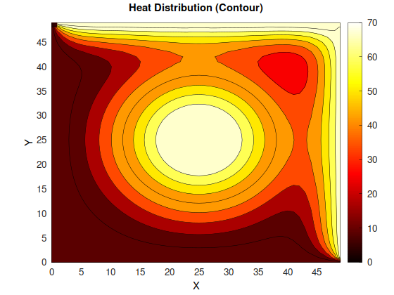

# High-Performance Computing Research Repository

A collection of computational performance analysis projects focusing on algorithm optimization, parallel computing, and hardware-software interaction studies.

## Final Project: 2D Laplace Heat Equation Solver

**Parallel Numerical Methods for Scientific Computing**

A comprehensive implementation of the 2D Laplace heat equation solver using multiple numerical methods (Gauss-Seidel and Jacobi) with both serial and parallel approaches. This project demonstrates the practical application of HPC techniques to scientific computing problems.

**Key Features:**
- Serial and parallel Gauss-Seidel iterative solvers
- Serial and parallel Jacobi iterative solvers
- MPI-based distributed computing with domain decomposition
- OpenMP multithreading for shared memory parallelism
- Hybrid MPI+OpenMP implementations
- Convergence analysis and performance benchmarking
- Visualization tools for heat distribution analysis

**[View Full Project →](./04-heat/)**

---

## Repository Overview

This repository contains multiple independent research projects exploring various aspects of high-performance computing, with emphasis on:

- **Algorithm Performance Analysis**: Comparative studies of different computational approaches
- **Parallel Computing Strategies**: Threading, process distribution, and scalability analysis
- **Memory Hierarchy Optimization**: Cache efficiency, NUMA awareness, and memory access patterns
- **Compiler Optimization Impact**: Effects of various compilation flags and strategies
- **GPU and CUDA Programming**: Speedup capabilities and SIMT architecture exploitation
- **SIMD Vectorization**: AVX instruction sets and vector register optimization
- **Multithreading in Computing Kernels**: Efficient implementation and effectiveness analysis
- **Interprocess Communication**: MPI message passing costs vs benefits
- **Domain Decomposition**: Partitioning strategies for distributed numerical solvers
- **Numerical Methods**: Iterative solvers and convergence analysis
- **Scientific Visualization**: Data analysis and heatmap generation

## Intro Projects

### [Project 1: High Performance Matrix Framework](./01-matrix/)

- Comparative analysis of 8 matrix multiplication algorithms: serial, parallel threaded, and cache-optimized blocked implementations with performance benchmarking.

- **Key Features:** Serial/parallel/blocked algorithms, cache optimization, thread-safe processing, compiler optimization studies

-----------------

### [Project 2: SIMD Vectorization with AVX-512](./02-simd/)

- AVX-512 instruction set implementation for vectorized matrix operations with cache locality optimization and vector register performance analysis.

- **Key Features:** AVX-512 SIMD instructions, cache architecture analysis, register vs cache performance comparison

-----------------

### [Project 3: Multi-Core Parallelization](./03-multicore/)

- Exploring multi-core CPU performance through parallel algorithm implementations and thread scaling analysis.

- **Key Features:** Thread pool management, core affinity optimization, scalability benchmarking, NUMA-aware design

-----------------

### [Project 4: GPU Computing with CUDA](./04-cuda/)

- GPU acceleration using CUDA for compute-intensive algorithms, demonstrating SIMT architecture and massive parallelism.

- **Key Features:** CUDA kernel development, memory coalescing, shared memory optimization, GPU vs CPU performance analysis

-----------------

### [Project 5: Distributed Computing with MPI](./05-mpi/)

- Message Passing Interface implementation for distributed memory systems with process-based parallelization strategies.

- **Key Features:** Point-to-point and collective communication, domain decomposition, load balancing, network performance analysis

## Getting Started

Each subproject contains its own build system and documentation. Navigate to individual project directories for specific instructions.

## Research Applications

This repository supports research in:

- **Computational Performance Engineering**: Understanding algorithm efficiency across different hardware
- **Parallel Computing Education**: Demonstrating threading concepts and trade-offs
- **Systems Programming**: Low-level optimization techniques and memory management
- **Academic Benchmarking**: Standardized performance comparison methodologies

## Contributing

This repository serves as an academic research collection. Each project maintains its own contribution guidelines and research objectives.

## Academic Context

Part of directed research in high-performance computing, focusing on practical performance analysis and optimization techniques for computational algorithms.