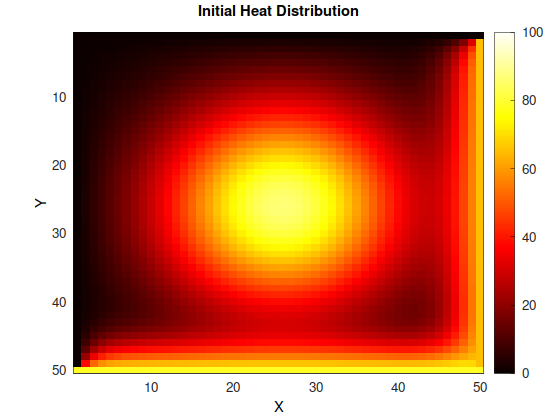
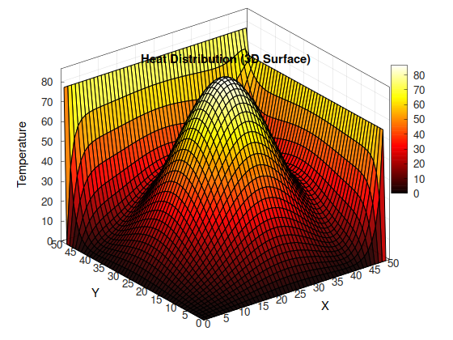

# Final Project: Laplace 2D Heat Equation Diffusion Simulation

## Abstract
This project simulates the physical process of heat diffusion across a 2D surface using numerical methods, with a strong emphasis on **multithreaded parallelization** as a core HPC technique. The implementation explores both sequential and parallel approaches to solving the Laplace heat equation, demonstrating the challenges and trade-offs of parallelizing iterative PDE solvers. The primary focus is on accurately modeling the physics of heat transfer while leveraging multicore architectures to accelerate computation through C++ threading primitives.

---

## 1. Introduction

Heat diffusion is a fundamental physical process governed by the heat equation, a partial differential equation that describes how temperature propagates through a medium over time. This project implements a 2D heat diffusion simulator that numerically solves this equation and visualizes the results.

**Objective**: To create an accurate numerical simulation of heat transfer using both sequential and parallel multithreaded approaches, visualize the thermal evolution through heatmaps and surface plots, and explore the computational challenges of parallelizing iterative solvers while demonstrating HPC techniques from the **03-multicore** module.


<!-- *Figure 1: 2D heatmap showing temperature distribution* -->

---

## 2. Background

### 2.1 Physics of Heat Diffusion

- **Heat Equation**: The 2D heat equation is given by ∂T/∂t = α∇²T, where T is temperature, t is time, α is thermal diffusivity, and ∇² is the Laplacian operator. This describes how heat spreads from high to low temperature regions.

- **Thermal Diffusivity**: Material property (α) that determines how quickly heat propagates. Higher values mean faster diffusion.

- **Boundary Conditions**: Define how the edges of the simulation domain behave. For our purposes these boundary conditions are fixed.

- **Initial Conditions**: Starting temperature values for each 'cell' that evolve according to the heat equation.

### 2.2 Numerical Methods

- **Finite Difference Method**: Essentially turns the continuous heat equation into a grid where next cell values are approximated by differences between neighboring points.

<!-- - **Explicit vs Implicit Schemes**: Explicit methods (like forward Euler) are simple but require small time steps for stability. Implicit methods are stable but require solving linear systems. -->

<!-- - **Stability Criteria**: The CFL (Courant-Friedrichs-Lewy) condition constrains the time step size based on grid spacing to ensure numerical stability. -->

- **Convergence**: As grid resolution increases and time steps decrease, the numerical solution should approach the analytical solution for some epsilon > 0.

---

## 3. HPC Implementation: Multithreaded Parallelization

### 3.1 Jacobi vs Gauss-Seidel: A Parallelization Tale

This project implements both **Jacobi** and **Gauss-Seidel** iterative methods to solve the approximated heat equation, revealing fundamental differences in their parallelizability:

**Jacobi Method - Highly Parallelizable:**
- Updates all grid points using values from the **previous iteration**
- No data dependencies between grid points within an iteration
- Perfectly suited for parallel execution across multiple threads
- **Double-buffering strategy**: Uses two grids that swap roles each iteration .

**Gauss-Seidel Method - Sequential by Nature:**
- Updates grid points **in-place** using the most recently computed values
- Cannot be easily and effectively parallelized.
- Sequential implementation only here.

### 3.2 Multithreaded Jacobi Implementation

The parallel Jacobi solver demonstrates HPC techniques from the **03-multicore** module:

**Grid Swapping Technique:**
```cpp
// Alternates between reading from grid/prev and writing to prev/grid
if (i % 2 == 1) {
    Solver::jacobi_2(prev, grid, index);  // Read from grid, write to prev
} else {
    Solver::jacobi_2(grid, prev, index);  // Read from prev, write to grid
}
```
This eliminates the need to copy data between iterations while maintaining correctness; with this implementation we only need to create two grids total for Jacobi's method even though logically the algorithm requires a new grid each iteration.

**Thread Synchronization:**
- 25 threads partition the grid into 5×5 subregions
- `std::barrier` ensures all threads complete before swapping grid roles
- Each thread processes its assigned region independently

### 3.3 Performance Limitations and Trade-offs

**Cache Efficiency Challenges:**
- Row-major memory layout means column-wise traversal has poor spatial locality
- Accessing neighbors `grid(i-1,j)` and `grid(i+1,j)` causes cache misses (the CPU accesses the first cache line with `grid(i,j)`, `grid(i,j-1)`, and `grid(i,j+1)`, but has to access the cache twice more to access the rows with `grid(i-1,j)` and `grid(i+1,j)`). Lessons learned from the first few projects in this course tell us to transpose, but:
- Cannot transpose the grid without breaking the stencil access pattern
- Memory access pattern: `grid(i, j-1)`, `grid(i, j+1)`, `grid(i-1, j)`, `grid(i+1, j)` requires both horizontal and vertical neighbors, which blocks the transposition and thus eliminates our hopes for sequential data access

**AVX/SIMD Limitations:**
- Stencil computation requires values from non-contiguous memory locations (up, down, left, right neighbors)
- Vertical neighbors `grid(i-1,j)` and `grid(i+1,j)` are separated by full row strides in memory like mentioned above
- Cannot vectorize effectively with AVX instructions due to irregular memory access pattern
- Four-neighbor averaging operation doesn't map cleanly to vector operations

**Parallelization Overhead:**
- Fine-grained synchronization barriers reduce parallel efficiency
- Thread creation and barrier synchronization add overhead
- For small grid sizes, sequential Jacobi may outperform parallel version
- Gauss-Seidel typically converges faster than Jacobi (fewer iterations) but cannot be parallelized

---

## 4. Methodology

### 4.1 Implementation Details

The simulation uses a finite difference scheme to discretize the 2D heat equation on a rectangular grid:

1. **Spatial**: The domain is divided into an NxN grid where each cell represents a temperature value.

<!-- 2. **Time Stepping**: An explicit forward Euler scheme updates temperatures at each time step based on neighboring cell values. -->

2. **Numerical Scheme**: The stencil update formula is:
   ```cpp
   grid(i, j) = 0.25 * (grid(i, j-1) + grid(i, j+1) + grid(i-1, j) + grid(i+1, j));
   ```

3. **Visualization**: Custom C++ visualization using matplot++ library generates heatmaps, 3D surface plots, and contour plots at each iteration.

### 4.2 Experimental Setup

- **Hardware**: Linux system with modern multicore CPU
- **Software**: C++ with `<thread>`, `<barrier>` for multithreading; matplot++ for visualization
- **Compiler**: GCC with `-O3` optimization
- **Threading**: 25 threads for parallel Jacobi (5×5 grid decomposition)
- **Grid Sizes**: Tested with various resolutions (e.g., 50×50, 100×100, 200×200)
- **Initial Conditions**: Gaussian heat distribution centered in domain
- **Boundary Conditions**: Fixed temperature boundaries

<!-- ### 4.3 Simulation Parameters

- **Thermal Diffusivity (α)**: Controls heat spread rate
- **Time Step (dt)**: Chosen to satisfy stability criteria
- **Grid Spacing (dx)**: Determines spatial resolution
- **Total Time**: Simulation duration to observe equilibrium
- **Visualization Frequency**: How often to save plots/frames -->

---

## 5. Results

### 5.1 Thermal Evolution

The simulation successfully captures the physical behavior of heat diffusion:


<!-- *Figure 2: 3D surface visualization showing temperature as height* -->

The visualizations demonstrate:
- Heat spreads from high-temperature regions to cooler areas
- Temperature gradients smooth out over time
- System evolves toward thermal equilibrium
- Boundary conditions properly enforced throughout simulation

### 5.2 Visual Analysis


<!-- *Figure 3: Contour plot showing isothermal lines* -->

Multiple visualization methods provide different insights:
- **Heatmaps**: Show spatial temperature distribution with color coding
- **3D Surface Plots**: Reveal temperature gradients with peaks and valleys
- **Contour Plots**: Display lines connecting points of equal temperature

### 5.3 Physical Observations

1. **Heat Propagation**: Temperature diffuses radially from heat sources as expected from the physics
2. **Conservation**: Total thermal energy is conserved in insulated boundary scenarios
3. **Equilibrium**: System reaches steady-state when temperature gradients vanish
5. **Boundary Effects**: Edge conditions significantly influence final temperature distribution

### 5.4 Speed Observations

- I observed that for small workloads, the parallel algorithms proved to be much slower than the standard implementations, most definitely because of thread overhead
- On the other hand, when workloads increased, the parallel algorithms proved to be in fact much faster than the standard implementations

---

## 6. Discussion

This project demonstrates how computational methods can simulate real-world physical phenomena. Key insights:

**Physics Accuracy**:
- The finite difference method accurately approximates the continuous heat equation
- Physical laws (conservation, diffusion dynamics) are preserved in the discrete formulation
- Numerical stability can be tricky to tune

**Visualization Value**:
- Multiple visualization types provide complementary perspectives on the same data
- Real-time visualization helps debug physics implementation and verify physical correctness
- Color mapping choices significantly impact interpretation of results

**Multithreading and HPC Lessons**:
- **Jacobi's parallelizability**: Data independence enables clean thread decomposition with barrier synchronization
- **Gauss-Seidel's sequential nature**: In-place updates create dependencies that prevent effective parallelization
- **Grid swapping optimization**: My double-grid swap method eliminates expensive memory copies between iterations
- **Memory access patterns matter**: Stencil computations resist both cache optimization (cannot transpose) and vectorization (non-contiguous access; no SIMD )
- **Parallel overhead tradeoff**: Synchronization costs can outweigh benefits for small problem sizes, but for longer workloads the parallel algorithms became much faster.

**Computational Considerations**:
- Grid resolution trades accuracy for computational cost
- Time step size affects both stability and simulation speed
- Algorithm choice (Jacobi vs Gauss-Seidel) involves trade-offs between convergence rate and parallelizability

**Applications**:
Heat diffusion simulations have applications in:
- Materials science (thermal management, heat treatment)
- Weather modeling (atmospheric temperature dynamics)
- Engineering (electronics cooling, building insulation)
- Medical imaging (thermal therapies)

---

## 7. Conclusion

This project successfully implements both sequential and **multithreaded** 2D heat diffusion simulators that capture the essential physics of thermal transport while demonstrating core HPC concepts from the **03-multicore** module. The implementation reveals fundamental insights about parallelizing iterative numerical solvers.

**Key Achievements**:
- Implemented both Jacobi (parallelizable) and Gauss-Seidel (sequential) methods, illustrating the critical importance of data dependencies in parallel algorithm design
- Developed an efficient multithreaded Jacobi solver using 25 threads with grid decomposition and barrier synchronization
- Applied double-buffering (grid swapping) technique to eliminate memory copy overhead between iterations
- Identified fundamental limitations: cache inefficiency due to stencil access patterns, inability to transpose for optimization, and poor AVX/SIMD applicability

The simulation demonstrates fundamental computational physics principles: discretizing continuous equations, satisfying stability criteria, and validating results against physical expectations. More importantly, it shows that **algorithm selection matters**, as choosing between Jacobi and Gauss-Seidel involves balancing convergence speed against parallelizability.

This project illustrates that effective parallel programming requires understanding both the algorithm's mathematical structure and the underlying hardware constraints (cache locality, memory bandwidth, synchronization overhead).

---

## 8. Future Work

**HPC Enhancements**:
- **Red-Black Gauss-Seidel**: Implement checkerboard ordering to parallelize Gauss-Seidel method
- **GPU Acceleration**: Port to CUDA/OpenCL for massive parallelism across thousands of cores
- **MPI Distribution**: Scale to multiple nodes for very large grids using domain decomposition
- **Cache Blocking**: Optimize memory access patterns with tiled iteration
- **Thread Pool**: Reduce overhead by reusing threads across iterations instead of barrier synchronization

**Physics and Numerics**:
- **3D Heat Diffusion**: Extend to three spatial dimensions
- **Adaptive Time Stepping**: Dynamically adjust dt based on temperature gradients
- **Multiple Materials**: Simulate interfaces between materials with different thermal properties
- **Non-uniform Grids**: Use finer resolution near heat sources
- **Implicit Solvers**: Implement unconditionally stable methods for larger time steps
- **Validation Studies**: Compare with analytical solutions for simple geometries

**Visualization**:
- **Animation Export**: Generate videos showing temporal evolution
- **Interactive GUI**: Real-time parameter adjustment and visualization

---
